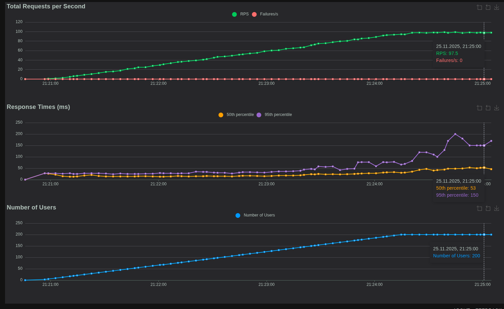

# Avito Backend Trainee (Python)

## Структура проекта

### Сервисы

* **app** - основное приложение (FastAPI)
    * Порт: `8080`
    * Зависит от PostgreSQL
    * Автоматически применяет миграции (Alembic) при старте
    * Авторестарт при изменениях кода (в режиме разработки)

* **db** - база данных (PostgreSQL)
    * Порт: `5432`
    * Volume для персистентного хранения данных
    * Health check для проверки готовности

### Docker

Используется **Python 3.13**.

* Управление зависимостями: **Poetry**.
* Миграции: Накатываются командой `alembic upgrade head` автоматически при старте контейнера.

---

## Дополнительные задания выполнены

1. **Реализовал эндпоинт статистики** `GET /stats`
   Возвращает JSON с агрегированными данными по ревьюерам и PR:
   ```json
   {
       "total_pull_requests": 10,
       "pull_requests_open": 5,
       "pull_requests_merged": 5,
       "top_reviewers": [
           {
               "user_id": "u1",
               "review_count": 3
           }
       ]
   }
   ```

2. **Настроил линтер и форматтер**
   Используется **Ruff** (быстрая замена Flake8, Black, isort).
    * Проверка: `make lint`
    * Автоисправление: `make format`

3. **Реализовал интеграционное тестирование**
    * Стек: `pytest`, `pytest-asyncio`, `httpx`.
    * Тесты запускаются на изолированной базе данных (SQLite).
    * Покрытие кода : **95%**.
    * Команда запуска: `make test`

4. **Провел нагрузочное тестирование**
    * Инструмент: **Locust**.
    * Профиль нагрузки: Эмуляция активной работы пользователей (создание PR, запросы статистики).
    * **Краткие результаты:**
        * RPS ~ 97
        * Время ответа < 300мс
        * Успешность = 100%
        * 

---

## Конфигурация

### .env.example

```bash
    APP_PORT=8080
    DB_HOST=db
    DB_PORT=5432
    DB_NAME=avito_trainee_db
    DB_USER=user
    DB_PASSWORD=password
```

### app/config.py

* Используется библиотека pydantic-settings для валидации переменных окружения и загрузки конфигурации.

# Запуск в Docker

## Сборка и запуск контейнеров:

```bash
    make docker-build
    make docker-up
```

### Приложение будет доступно по адресу: http://localhost:8080

# Makefile

* В проекте настроен Makefile для быстрого доступа к частым командам:

```bash
    docker-up - Запустить контейнеры Docker.
    docker-clean - Остановить контейнеры и удалить старые образы.
    docker-build - Собрать образы Docker.
    test - Запустить тесты Pytest с отчетом о покрытии.
    lint - Проверить код линтером Ruff.
    format - Отформатировать код и исправить импорты.
    deps - Установить зависимости через Poetry.
    build - Собрать Python-пакет.
    run - Запустить приложение локально.
    clean - Удалить кэш и временные файлы.
```

## Технологии

* **Язык:** Python 3.13
* **Фреймворк:** FastAPI
* **База данных:** PostgreSQL 15
* **Миграции:** Alembic
* **Управление зависимостями:** Poetry
* **Линтер / Форматтер:** Ruff
* **Тестирование:** Pytest
* **Нагрузочное тестирование:** Locust